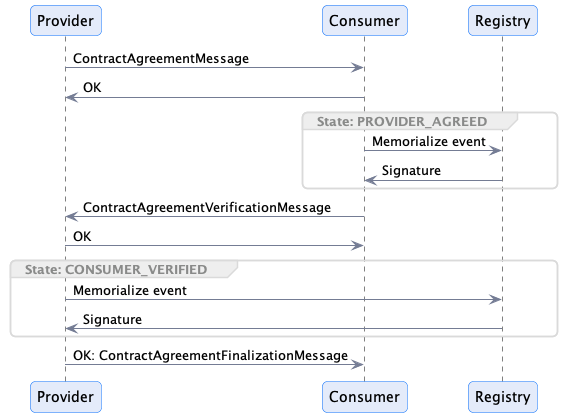

# Signing and Memorialization Overlay (SAMO)

Parties in a dataspace may wish to memorialize a Contract Agreement with one or more third-party `Registry` services. A Registry is a trusted actor that can
be used to provide proof that an event occurred at a given time and has not been tampered with. For example, a consumer may memorialize that a signed _Contract Agreement_ was
received from a provider. Likewise, a provider may memorialize that a signed _Contract Agreement verification_ was received from a consumer. The data to be memorialized is termed
an **_event_**.

Events:

- are opaque to the Registry, i.e. the Registry only receives a hash of the event.
- cannot be correlated between the provider and consumer by the Registry. In other words, the Registry cannot infer that a Contract Agreement was made by two specific
  parties by correlating events without additional information.
- may be memorialized with multiple registries for redundancy.

SAMO is designed as a message exchange protocol that can be layered on top of the IDS Dataspace _**contract negotiation protocol**_.

## Design Principles

1. Parties memorialize events with a Registry. Events contain data with a GUID. For example, a contract signing event may include the Contract Agreement.
2. The purpose of memorialization is to provide proof that an event occurred and that the data associated with the event has not been tampered with.
3. Consumer and provider memorialization are independent processes.
4. The counter-party to an agreement event and its data are opaque to the Registry. Only the party memorializing the event is known.
5. The role of the Registry is **NOT** to prove two parties signed an agreement.
6. All message exchanges can be done using reliable delivery. This requires operations to be idempotent.

# Approach

The provider and consumer will generate and share a JWS with the other party during the `ContractAgreementMessage` and `ContractAgreementVerification` exchanges respectively.
The JWS will be generated by taking the expanded JSON-LD form of the Contract Agreement (an ODRL Policy) and converting it to a canonical representation
using [RDF Dataset Canonicalization](https://www.w3.org/community/reports/credentials/CG-FINAL-rdf-dataset-canonicalization-20221009/).

Each party will then hash the JWS to create an `EventMessage`. The `EventMessage` can then be sent to a Registry service for non-repudiation, which provides a `receipt`. Hashing
signatures (JWS) and separating the memorialization in distinct, timestamped operations performed by the consumer and provider ensures that:

1. Third parties (e.g. a Registry) cannot correlate both parties of a Contract Agreement.
2. Third parties (e.g. a Registry) are not privy to the contents of the Contract Agreement.
3. Non-repudiation is guaranteed even in the event that a private key is compromised in the future (via timestamped receipts sent by the Registry).
4. Each party may use multiple registries for a single agreement for redundancy.
5. The Registry is a simple event store which can be implemented efficiently and is not limited to Contract Agreement events. For example, registries can offer non-repudiation
   services for other dataspace events.
6. The Registry does not have knowledge of the type of event its is providing a receipt for. This provides a measure of privacy for the registering party if multiple event types
   are processed.

# Registry Memorialization

The Registry is a secure event store that is used to provide proof that an event occurred at a given time and has not been tampered with. The consumer and provider interact with
the Registry to create non-repudiable events according to the following sequence:

## Phase 1: Consumer Memorialization

1. The provider canonicalizes the Contract Agreement by taking its expanded JSON-LD form and using `RDF Dataset Canonicalization` to create a JWS. This JWS is transmitted in
   the `ContractAgreementMessage` sent to the consumer.
1. The consumer receives the `ContractAgreementMessage` (Contract Agreement and JWS) and verifies the JWS against the canonical form of the `ContractAgreement`.
1. The consumer hashes the provider JWS and creates a JWS.
1. The consumer sends an `EventMessage` containing JWS to the Registry.
1. The Registry records the `EventMessage` and creates a signed `Receipt` (containing the JWS and a UTC timestamp), and sends it to the consumer.
1. The consumer receives the `Receipt` from the Registry and stores it.

## Phase 2: Provider Memorialization

1. The consumer canonicalizes the Contract Agreement by taking its expanded JSON-LD form and using `RDF Dataset Canonicalization` to create a JWS. This JWS is transmitted in
   the `ContractAgreementVerification` sent to the provider.
1. Provider receives the consumer verification (agreement with the consumer detached JWS).
1. The provider hashes the consumer JWS and creates a JWS.
1. The provider sends an `EventMessage` containing the JWS to the Registry.
1. The Registry records the `EventMessage` and creates a `Receipt` (containing the hash, a UTC timestamp, and a detached JWS), and sends it back to the provider.
1. The Registry records the `EventMessage` and creates a signed `Receipt` (containing the JWS and a UTC timestamp), and sends it to the provider.
1. The provider sends a FINALIZED message to the consumer.

## Scenarios

#### Provider does not memorialize

The provider never registers with the Registry. The consumer can prove it received a signed agreement from the provider and when it was
memorialized using the Registry timestamp.

#### Consumer does not memorialize

The consumer never registers with the Registry. The provider can prove it received a signed agreement from the consumer and when it was
memorialized using the Registry timestamp.

#### Consumer does not verify

The provider does not advance the state to FINALIZED and the consumer will not have access to the data. 

